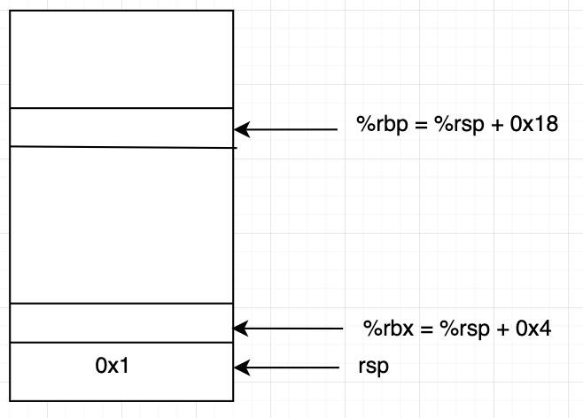

This is an x86-64 bomb for self-study students. 

## command
- objdump
> objdump -d bomb > bomb.dump
> 
> readelf -x .rodata bomb 可以查看object file中的data segment，包含所有的static variables及其地址

- gdb
> info registers 查看所有registers的值
> 
> p /x $rax  查看%rax寄存器的值
> 
> gdb -tui bomb 
> 
> (gdb) layout split  可以同时查看源码和assembly code
> 
> (gdb) b 13 在第13行设置断点
> 
> (gdb) run 运行程序到下一个断点
> 
> (gdb) n 运行到下一个断点
> 
> (gdb) s 单步运行 / si 前跳 i steps
> 
> (gdb) l bomb.c:50 查看第50行开始的源码
>

- vim
> /text 查找text | n跳到下一个结果
> 
> h l j k 左右上下，配合数字移动对应行数 20j 上移20行

## Phase_1
1. 目的基本就是熟悉objdump以及gdb的各项指令
2. objdump -d bomb > bomb.dump 得到object file的汇编码
3. gdb 模式下layout split 对照bomb.c源码找到phase_1函数的地址为0x400ee0; 并且read_line函数从控制台读取到user输入的字符串存储到了%rax中，调用phase_1(input)之前，mov %rax %rdi, 将输入字符串作为phase_1的参数
   


4. bomb.dump 中找到phase_1函数对应的assembly code, mov $0x402400 %esi, 将起始地址为0x402400的char*[]起始地址作为第二个参数，然后callq <strings_not_equal>,比较第一个参数(用户输入值存储在%rdi中)和第二个参数(程序中static data 0x402400)是否相等]
   


5. readelf -x .rodata bomb找到0x402400字符串, 00000000 代表字符串结束符'\0',查找ascii表2e对应'.';所以phase_1答案为:<strong>Border relations with Canada have never been better.</strong>


## Phase_2
1. phase_2调用read_six_number -> 调用scanf在phase_2开辟的栈空间地址上写入从stdin读取来的值
2. 400f0a处可得(%rsp) 必须为0x1
3. 400f30 ~ 400f35处限定了地址空间的范围，当%rbx 地址值 != %rbp, 每次作为计算 %rbx+=0x4
4. 400f17 ~ 400f1c 将计算方法确定，(%rbx)值为 2 * (%rbx)
5. lea -0x4(%rbx) 地址计算完再dereferecne M[%rbx - 0x4] 而不是 M[%rbx] - 0x4
```
0000000000400efc <phase_2>:
  400efc:       55                      push   %rbp #保存main函数的stack frame
  400efd:       53                      push   %rbx 
  400efe:       48 83 ec 28             sub    $0x28,%rsp # 开辟40bytes的栈空间
  400f02:       48 89 e6                mov    %rsp,%rsi  # %rsp地址作为参数 传递给read_six_numbers
  400f05:       e8 52 05 00 00          callq  40145c <read_six_numbers> #read_six中调用scanf将数值写入栈空间地址%rsp ~ %rsp + 0x18
  400f0a:       83 3c 24 01             cmpl   $0x1,(%rsp)   #(%rsp) 值为0x1
  400f0e:       74 20                   je     400f30 <phase_2+0x34> #跳转到 400f30
  400f10:       e8 25 05 00 00          callq  40143a <explode_bomb>
  400f15:       eb 19                   jmp    400f30 <phase_2+0x34>
  400f17:       8b 43 fc                mov    -0x4(%rbx),%eax  # M[%rbx - 0x4] 中的值赋给%eax
  400f1a:       01 c0                   add    %eax,%eax  # %eax *= 2
  400f1c:       39 03                   cmp    %eax,(%rbx) # %eax 值与 (%rbx)值做比较
  400f1e:       74 05                   je     400f25 <phase_2+0x29>
  400f20:       e8 15 05 00 00          callq  40143a <explode_bomb>
  400f25:       48 83 c3 04             add    $0x4,%rbx # %rbx中地址值+4
  400f29:       48 39 eb                cmp    %rbp,%rbx
  400f2c:       75 e9                   jne    400f17 <phase_2+0x1b>
  400f2e:       eb 0c                   jmp    400f3c <phase_2+0x40>
  400f30:       48 8d 5c 24 04          lea    0x4(%rsp),%rbx # %rbx 取得栈顶+0x4的地址
  400f35:       48 8d 6c 24 18          lea    0x18(%rsp),%rbp # %rbp 取得栈顶+0x18的地址 也就是对应6位数字的最后一位
  400f3a:       eb db                   jmp    400f17 <phase_2+0x1b>
  400f3c:       48 83 c4 28             add    $0x28,%rsp
  400f40:       5b                      pop    %rbx
  400f41:       5d                      pop    %rbp
  400f42:       c3                      retq
```
```
#以phase_2传递过来的%rsp为基准，使用%rcx, %rax, %r8, %r8, read_six_number栈空间+0x8, +0x00的位置存储scanf读取到的数值，
#寄存器及栈空间存储的都是phase_2栈空间上的地址，scanf直接将keyboard输入的值写入
read_six_numbers: 
  40145c:       48 83 ec 18     subq    $24, %rsp
  401460:       48 89 f2        movq    %rsi, %rdx
  401463:       48 8d 4e 04     leaq    4(%rsi), %rcx
  401467:       48 8d 46 14     leaq    20(%rsi), %rax
  40146b:       48 89 44 24 08  movq    %rax, 8(%rsp)
  401470:       48 8d 46 10     leaq    16(%rsi), %rax
  401474:       48 89 04 24     movq    %rax, (%rsp)
  401478:       4c 8d 4e 0c     leaq    12(%rsi), %r9
  40147c:       4c 8d 46 08     leaq    8(%rsi), %r8
  401480:       be c3 25 40 00  movl    $4203971, %esi
  401485:       b8 00 00 00 00  movl    $0, %eax
  40148a:       e8 61 f7 ff ff  callq   -2207 <__isoc99_sscanf@plt>
  40148f:       83 f8 05        cmpl    $5, %eax
  401492:       7f 05   jg      5 <read_six_numbers+0x3d>
  401494:       e8 a1 ff ff ff  callq   -95 <explode_bomb>
  401499:       48 83 c4 18     addq    $24, %rsp
  40149d:       c3      retq
```

