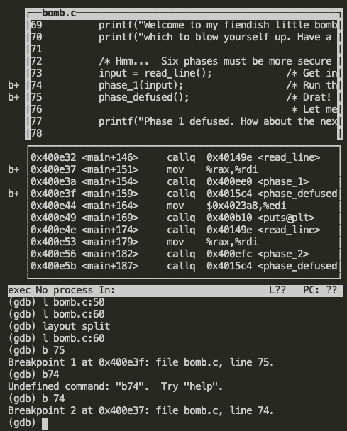

This is an x86-64 bomb for self-study students. 

## command
- objdump
> objdump -d bomb > bomb.dump
> 
> readelf -x .rodata bomb 可以查看object file中的data segment，包含所有的static variables及其地址

- gdb
> info registers 查看所有registers的值
> 
> p /x $rax  查看%rax寄存器的值
> 
> gdb -tui bomb 
> 
> (gdb) layout split  可以同时查看源码和assembly code
> 
> (gdb) b 13 在第13行设置断点
> 
> (gdb) run 运行程序到下一个断点
> 
> (gdb) n 运行到下一个断点
> 
> (gdb) s 单步运行 / si 前跳 i steps
> 
> (gdb) l bomb.c:50 查看第50行开始的源码
>

- vim
> /text 查找text | n跳到下一个结果
> 
> h l j k 左右上下，配合数字移动对应行数 20j 上移20行

## Phase_1
1. 目的基本就是熟悉objdump以及gdb的各项指令
2. objdump -d bomb > bomb.dump 得到object file的汇编码
3. gdb 模式下layout split 对照bomb.c源码找到phase_1函数的地址为0x400e0; 并且read_line函数从控制台读取到user输入的字符串存储到了%rax中，调用phase_1(input)之前，mov %rax %rdi, 将输入字符串作为phase_1的参数

4. bomb.dump 中找到phase_1函数对应的assembly code, mov $0x402400 %esi, 将起始地址为0x402400的char*[]起始地址作为第二个参数，然后callq <strings_not_equal>,比较第一个参数(用户输入值存储在%rdi中)和第二个参数(程序中static data 0x402400)是否相等

5. readelf -x .rodata bomb找到0x402400字符串, 00000000 代表字符串结束符'\0',查找ascii表2e对应'.';所有phase_1答案为:<strong>Border relations with Canada have never been better.</strong>

